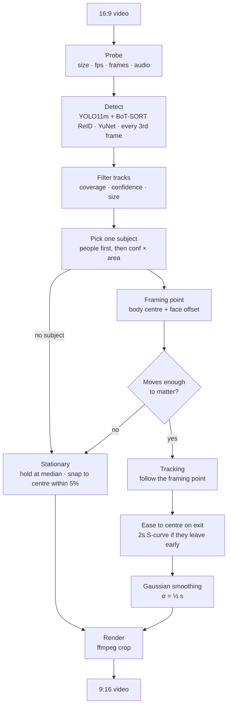

# Smart Video Reframing

Smart Video Reframing is an automatic 16:9 to 9:16 video reframing pipeline that combines object detection, tracking, face-aware subject framing, and temporal smoothing to produce stable portrait crops.

The crop window is full height and fixed to 9:16. The only free parameter is the horizontal position over time, `x(t)`. The planner chooses that path so a landscape clip can be published as a portrait video without letterboxing or stretching.

## Motivation

Short-form platforms expect 9:16. Most source footage is still 16:9. A centre crop is cheap and often wrong: the subject walks out of frame, two people pull the window into the gap between them, or a static shot jitters because the detector flickered.

This project treats reframing as a temporal camera-path problem, not a per-frame “smart crop.” Detect and follow one subject, hold still when they barely move, follow them when they travel, and ease back to centre if they leave.

## Pipeline



## Algorithm overview

The window keeps the full source height, so its size is fixed. Everything below exists to choose the left edge `x(t)`.

1. **Detect.** YOLO11m + BoT-SORT with appearance ReID, every 3rd frame, plus YuNet for faces. Follow a track, not a class. Averaging two people puts the window in the gap between them.
2. **Filter.** A track has to appear in ≥ 40% of sampled frames (empty frames count) with mean confidence ≥ 0.60, and cover ≥ 5% of the frame. People skip the size check, so a small distant person still counts. Nothing left: centre crop.
3. **One subject.** People over objects, then the highest sum of confidence × area. Chosen once for the clip.
4. **Aim.** Body centre, plus the face’s offset from the body on frames where a face was found. That offset is interpolated across missed faces, so the target does not jump back to the torso. Under 30% of frames with a face, use the body.
5. **Hold or follow.** If the point travels ≤ 0.15 of the frame width, one window at the median, snapped to centre when that is already within 5%. Otherwise follow it.
6. **Moving path.** If the subject leaves early, ease back to centre over 2s ([smoothstep](https://en.wikipedia.org/wiki/Smoothstep), flat at both ends) instead of staying pointed at the exit. Then a Gaussian, σ = ⅓ s, over the whole path so the window does not lag or jitter. There is no speed cap: a fast subject still gets a fast window.
7. **Render.** One FFmpeg crop. A moving path is a `sendcmd` script, so frames never enter Python.

Two reference planners ship beside the default **director** method: `center` (locked-off middle crop) and `naive-track` (follow a class-average box, no instance, no smoothing). They exist so you can see what the temporal logic avoids.

## Installation

`ffmpeg` and `ffprobe` need to be on `PATH`. On macOS:

```bash
brew install ffmpeg
```

Then:

```bash
uv sync
```

The first run downloads YOLO11m and YuNet weights into `cache/models/` (gitignored).

Python 3.11+ is required. This repo pins `3.14` via `.python-version` because that is the development interpreter; `uv` will use it if installed.

## Single-video usage

```bash
uv run python -m smartcrop convert path/to/input.mp4
```

Writes `path/to/input_portrait.mp4` next to the source. To choose the destination and planner:

```bash
uv run python -m smartcrop convert path/to/input.mp4 path/to/output.mp4
uv run python -m smartcrop convert path/to/input.mp4 path/to/output.mp4 --planner center
uv run python -m smartcrop convert path/to/input.mp4 path/to/output.mp4 --planner naive-track
```

From Python:

```python
from smartcrop.pipeline import reframe

reframe("input.mp4", "output.mp4")
```

## Batch usage

Drop landscape videos into `data/videos/` (`.mp4`, `.mov`, `.mkv`, `.m4v`, `.webm`, `.avi`), then:

```bash
uv run python -m smartcrop batch
```

Renders go to `outputs/director/` as `.mp4`, with a `decisions.csv` beside them. Existing outputs are skipped unless you pass `--force`.

```bash
uv run python -m smartcrop batch --videos /path/to/clips --out /path/to/out --planner director --force
```

## Live Demo

**Hosted:** [huggingface.co/spaces/idopinto/smart-video-reframing](https://huggingface.co/spaces/idopinto/smart-video-reframing)

`demo.py` is a mobile-first Gradio UI. Upload a short landscape clip, then download a 9:16 crop. It calls the same `reframe()` pipeline as the CLI.

**Run locally**

```bash
uv sync
uv run python demo.py
```

The Space runs on Hugging Face **ZeroGPU** (no hourly charge). Visitors spend their own daily GPU quota. CPU Gradio Spaces need a paid plan.

**Hosted-demo constraints**

ZeroGPU quota is short, so the public demo:

- accepts clips up to **20 seconds** and **100 MB**
- uses **YOLO11n** instead of YOLO11m
- writes uploads and outputs to a **temporary directory**
- prefers landscape 16:9; other aspect ratios fail with a clear error instead of crashing
- does not use a local evaluation library or cached tracks from `data/` / `cache/`

Framing logic is unchanged. The FFmpeg crop is still full resolution. Longer videos and YOLO11m stay on the CLI and in the evaluation app.

Optional: put a few rights-cleared 16:9 clips in `examples/` so visitors can try a result without uploading. Footage is not shipped in the repo.

**`demo.py` vs `app.py`**

| Feature | `demo.py` | `app.py` |
| --- | --- | --- |
| Audience | Public web demo | Local research / debugging |
| UI | Gradio (mobile-first) | Streamlit |
| Detector | YOLO11n | YOLO11m by default |
| Methods | Smart crop only | `center`, `naive-track`, `director` |
| Storage | Temp dirs | `data/videos/`, `outputs/` |
| Extra UI | Upload → Reframe → download | Mode filters, overlays, hyperparameters |

## Evaluation app

```bash
uv run streamlit run app.py
```

Local library in `data/videos/`. Compare planners, overlay boxes, plot `x(t)`, and tune director settings. Optional `data/titles.csv` with columns `file,title` for search labels.

## Project structure

```
.
├── demo.py                # Public Gradio demo (Hugging Face Spaces app file)
├── app.py                 # Local Streamlit evaluation UI
├── packages.txt           # apt packages for Spaces (`ffmpeg`)
├── requirements.txt       # pip packages for Spaces
├── runtime.txt            # Python 3.12 hint for other hosts
├── smartcrop/
│   ├── __main__.py        # CLI: convert, batch
│   ├── pipeline.py        # reframe() / reframe_all()
│   ├── probe.py           # ffprobe metadata
│   ├── detect.py          # YOLO + BoT-SORT, YuNet, caches
│   ├── plan.py            # Director, center, naive-track
│   ├── render.py          # FFmpeg crop / sendcmd
│   ├── utils.py           # paths and 9:16 geometry
│   └── trackers/
│       └── botsort_reid.yaml
├── examples/              # optional short demo clips (gitignored)
├── data/
│   ├── README.md
│   └── videos/            # evaluation inputs (gitignored)
├── cache/                 # tracks, faces, models (gitignored)
└── outputs/               # evaluation renders (gitignored)
```

## Technical stack

| Stage | Tool |
| --- | --- |
| Object detection | YOLO11m (Ultralytics) |
| Tracking / ReID | BoT-SORT with appearance ReID |
| Face detection | YuNet (OpenCV Zoo) |
| Trajectory smoothing | SciPy Gaussian filter |
| Render | FFmpeg `crop` + `sendcmd` |
| Demo | Gradio (Hugging Face Spaces) |
| Packaging | `uv` + Hatch |

## Limitations

- Horizontal crop only. The window is always full height; there is no vertical pan or zoom.
- One subject per clip, chosen once. Speaker changes and two equally important people are not handled.
- Detection stride is 3 frames. Very short events can be missed, and tracks can end a frame or two early.
- Unusual subjects (tiny figures, heavy occlusion, non-person action) can fall through the filter and yield a centre crop.
- Phone videos with rotation metadata may probe as portrait while the stored pixels are landscape. Normalize orientation first if results look wrong.
- Scene cuts are not detected. A cut to a new subject will keep following the original track until it dies, then ease to centre.
- First-run downloads and YOLO inference are compute-heavy. The evaluation Streamlit app stays on CPU on Apple Silicon to avoid a Metal-on-background-thread crash; the CLI can use MPS or CUDA. The hosted demo uses YOLO11n for that reason.

No published accuracy numbers are claimed here. Compare methods visually in the evaluation app on your own footage.

## Potential future improvements

- Shot-boundary detection, then re-pick a subject per shot
- Multi-subject / speaker-change handling
- Audio-based speaker localisation
- Configurable output aspects (1:1, 4:5) and optional vertical motion
- Explicit handling of already-portrait or rotated inputs
- Learned crop quality instead of the current span threshold
- Automatic evaluation framework with a VLM-as-a-judge (score subject framing, hold vs follow, and stability against centre / naive-track)
- Optional letterbox fallback when a subject cannot be framed

## License

This project is MIT licensed. See `LICENSE`. Ultralytics YOLO remains AGPL-3.0.
